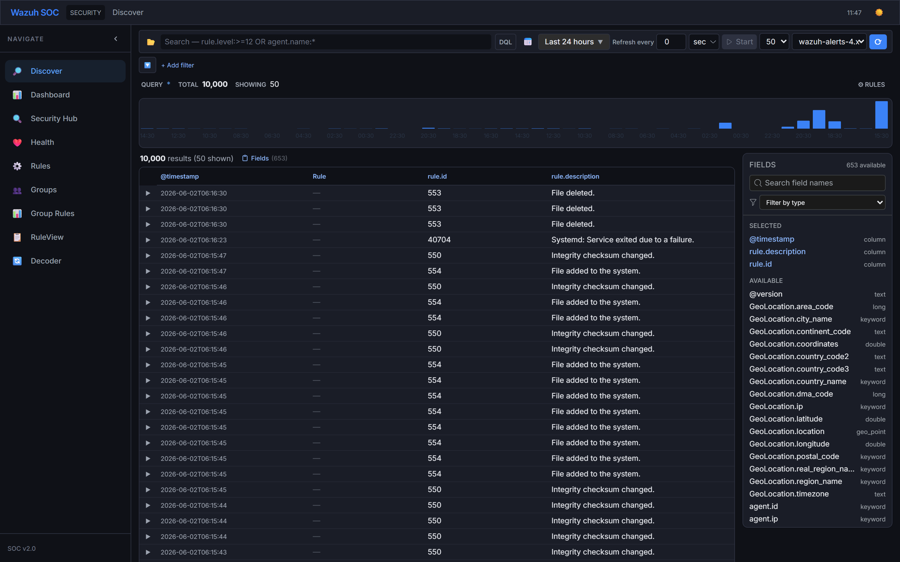
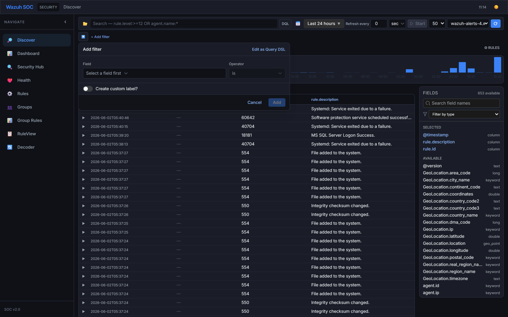
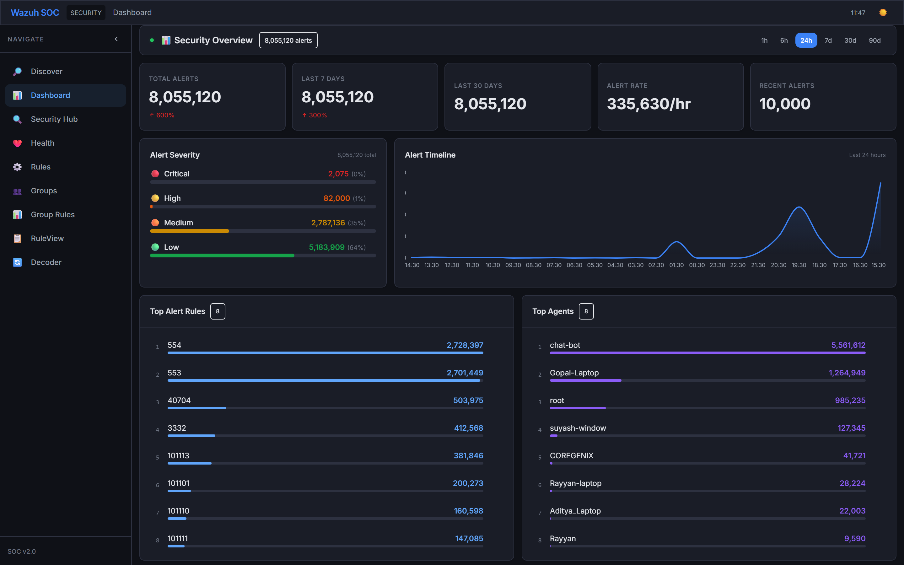
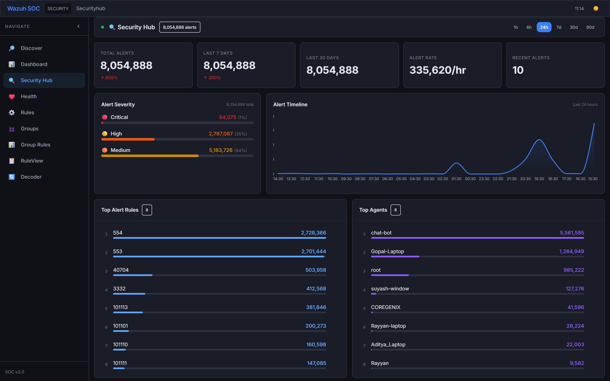
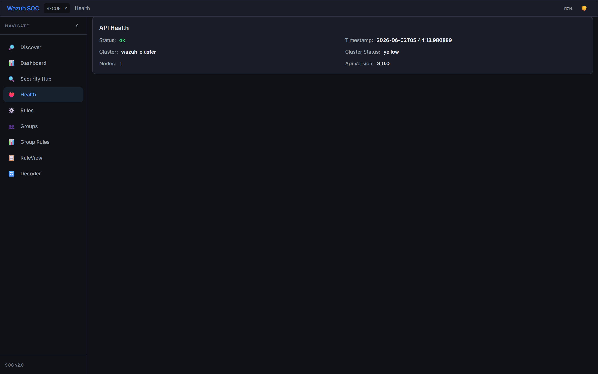
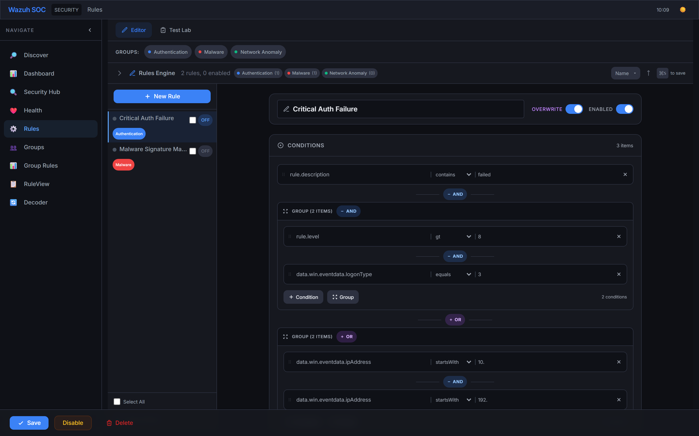
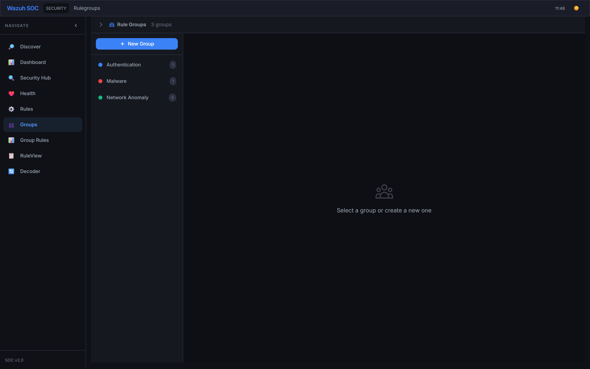
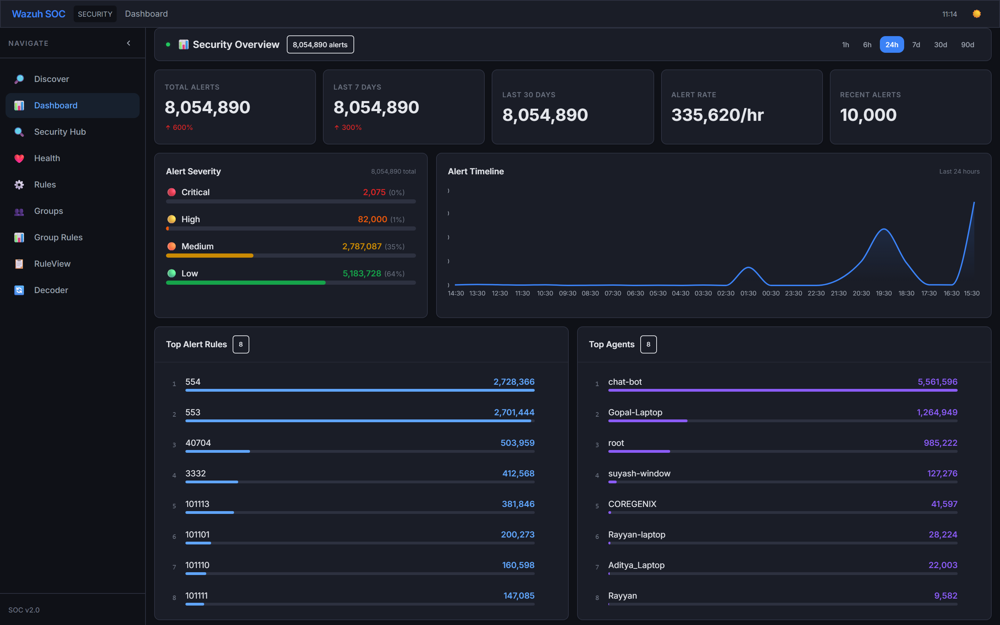
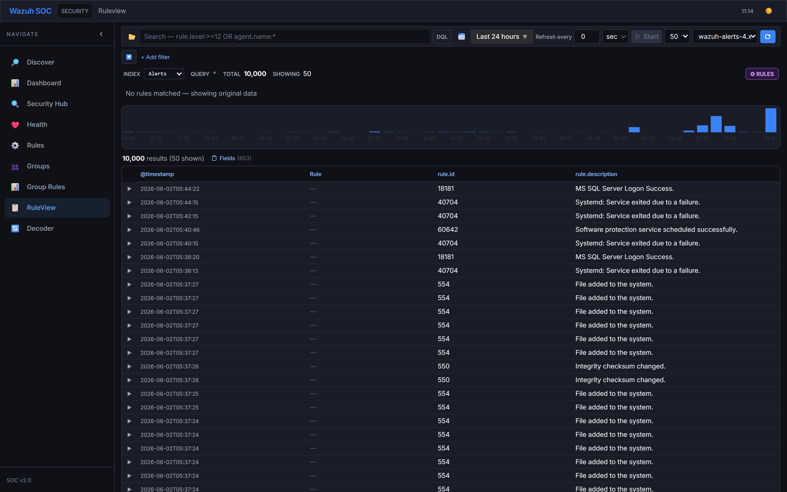

# Wazuh SOC Dashboard

A professional Security Operations Center (SOC) dashboard built with **React 18 + Vite 5 + Tailwind CSS 3**, connecting to Wazuh API for security event monitoring, analysis, rule engineering, and group management.

---

## Table of Contents

- [Features Overview](#features-overview)
- [Architecture](#architecture)
- [Plan & Implementation](#plan--implementation)
- [Data Flow](#data-flow)
- [Screenshots](#screenshots)
- [Setup](#setup)
- [Tech Stack](#tech-stack)
- [Project Structure](#project-structure)
- [Bugs Fixed](#bugs-fixed)
- [Changelog](#changelog)

---

## Features Overview

### 🔍 Discover — Log Explorer

Full OpenSearch/Kibana-style log exploration with:

| Feature | Detail |
|---------|--------|
| **DQL Search** | Type `rule.id:87702` or `rule.level:>=12 OR agent.name:*` — auto-parsed into filter chips |
| **Smart DQL Parser** | `rule.id:5502` → filter chip `rule.id is "5502"` (with quotes); `rule.level:>=12` → range filter; `rule.level:>=12 OR agent.name:*` → split into 2 filters with OR mode |
| **Filter Bar** | Add/edit/remove/pin/disable/invert filters; AND/OR toggle; persist as saved filter sets |
| **Histogram** | Time-series bar chart (48 buckets, 1h interval) above results |
| **Results Table** | Sortable columns, row expansion, Doc Viewer (Table/JSON), cell-level filter actions |
| **Field Sidebar** | Field list with type tokens (T/#/✓/D/IP), top-values popover, toggle column visibility |
| **Apply Rules** | Evaluate enabled rules against live results; severity-colored badges, group match breakdown, overwrite mode |
| **Auto-refresh** | Configurable interval (sec/min/hr) with Start/Stop toggle |
| **Quick Dates** | Last 15m/1h/24h/7d/30d/90d/1y + custom DateRangePicker |

### 📊 SOC Dashboard

7 live widgets with 60s auto-refresh:

- Summary cards (24h/7d/30d counts, alert rate)
- Severity distribution bars
- Alert timeline area chart
- Top rules & agents
- Categories donut chart
- Recent alerts feed

### 🛡️ Security Hub

Centralized security findings overview with drill-down search.

### ⚙️ Rules Engine

Full rule editor with:

- **Nested Condition Groups** — AND/OR groups with up to 3 levels, drag-and-drop reorder, flat/nested view toggle
- **Version Control** — Auto-saves (last 10), visual diff (green/red), rollback, compare, export as new rule
- **Bulk Operations** — Find & Replace, bulk tagging, bulk export (JSON/Sigma/clipboard), bulk clone, bulk test
- **Test Lab** — Dedicated testing with rule selection, JSON event editor, persistent test history (last 50)
- **Actions** — Alert (severity + custom level 0-15 + message interpolation), tag, ignore
- **Overwrite Mode** — Override `rule.level` and `rule.description` in Discover results
- **Ignore IPs** — CIDR-based IP exclusion per rule
- **Import/Export** — JSON-based rule sharing

### 👥 Rule Groups

- **Group CRUD** — Create/edit/delete with name, description, 12 preset colors
- **Many-to-Many** — Rules belong to multiple groups via `groupIds: []`
- **Group Sidebar** — Collapsible filter sidebar with search, DnD reorder, context menu
- **Bulk Actions** — Floating toolbar: add/move/remove/delete/enable/disable with progress bar
- **Group Rules Manager** — Full-page: Recharts pie chart, DnD rule assignment, JSON export/import, merge dialog
- **Discover Integration** — Color-coded group badges, group filter dropdown, per-group breakdown chips

### 🎨 UI/UX

- **Light / Dark mode** — Smooth CSS transitions, `data-theme` attribute, localStorage persistence
- **Inter font** + professional color palette (`#3b82f6` accent blue)
- **EUI-style components** — Refresh interval, date range picker, field type tokens
- **Responsive sidebar** — Collapse toggle with SVG chevron
- **Hover-reveal actions** — Filter for/out, toggle column, exists on every cell
- **Toast notifications** — Animated with 5s auto-dismiss and undo support
- **Custom scrollbar** — 8px with border clipping, Firefox `scrollbar-width: thin`

---

## Architecture

```
┌─────────────────────────────────────────────────────────────────────┐
│                        Browser (React SPA)                          │
│                                                                     │
│  ┌──────────┐  ┌──────────┐  ┌──────────┐  ┌───────────────────┐  │
│  │ QueryBar │  │DiscoverTab│  │ Filters  │  │   ResultsTable    │  │
│  │ (DQL inp) │  │(main view)│  │(chips)   │  │ (data grid)       │  │
│  └────┬─────┘  └────┬─────┘  └────┬─────┘  └────────┬──────────┘  │
│       │              │              │                  │            │
│       └──────────────┴──────┬───────┴──────────────────┘            │
│                             │                                      │
│                    ┌────────▼────────┐                              │
│                    │   AppContext    │  (Global State)             │
│                    │  (doSearch)     │                              │
│                    └────────┬────────┘                              │
│                             │                                      │
│                    ┌────────▼────────┐                              │
│                    │  api.js (axios) │  GET /api/search            │
│                    └────────┬────────┘                              │
└─────────────────────────────┼──────────────────────────────────────┘
                              │
┌─────────────────────────────┼──────────────────────────────────────┐
│                   Express Proxy Server (server.cjs)                 │
│                                                                     │
│                    ┌────────▼────────┐                              │
│                    │  Proxy Route     │  GET /api/{endpoint}        │
│                    │  → req.query    │  → Wazuh API                 │
│                    └────────┬────────┘                              │
│                             │                                      │
│                    ┌────────▼────────┐                              │
│                    │  JWT Auth       │  WAZUH_USER/PASSWORD         │
│                    │  (Bearer token) │  5-min refresh               │
│                    └────────┬────────┘                              │
└─────────────────────────────┼──────────────────────────────────────┘
                              │
                    ┌─────────▼──────────┐
                    │   Wazuh API        │
                    │   (OpenSearch)     │
                    └────────────────────┘
```

### Data Flow — Search

```
User types "rule.id:87702" in DQL box → Enter
         ↓
   submitSearch("rule.id:87702")
         ↓
   parseDql() → { field:"rule.id", value:"87702", operator:"is" }
         ↓
   addFilter("rule.id", "87702", false, "is")
         ↓
   Filter chip created: rule.id : "87702"
         ↓
   doSearch({ q: '' })
         ↓
   AppContext.doSearch():
     1. currentFilters = [{field:"rule.id", value:"87702", operator:"is"}]
     2. serverSafe = same filter (is operator is server-safe)
     3. buildDqlText() → rule.id:"87702"
     4. GET /api/search?q=rule.id:"87702"&index=wazuh-alerts-4.x-*&...
         ↓
   Express Proxy → Wazuh API /search?q=rule.id:"87702"
         ↓
   Response: { success:true, total:62, results: [...] }
         ↓
   extractTotal(response) → 62
   extractResults(response) → results array
         ↓
   applyClientFilters(results, currentFilters, 'and')
     • Already matched by server, but double-checks client-side
         ↓
   setTotal(62) / setResults([...])
         ↓
   ✅ ResultsTable renders 62 rows
```

### Complex DQL Flow — AND/OR

```
User types "rule.level:>=12 OR agent.name:*" → Enter
         ↓
   submitSearch("rule.level:>=12 OR agent.name:*")
         ↓
   splitDql():
     1. Detects " OR " → split into ["rule.level:>=12", "agent.name:*"]
     2. parseDql("rule.level:>=12") → range filter
     3. parseDql("agent.name:*") → wildcard filter
     4. setFilterMatch("or")
         ↓
   Filter chip 1: rule.level >= 12
   Filter chip 2: agent.name wildcard *
   Match mode: ANY (OR)
         ↓
   doSearch({ q: '' })
         ↓
   AppContext.doSearch():
     1. serverSafe = []  (range & wildcard excluded from server query)
     2. Server query: q=* (no server-side filtering)
     3. Server returns all recent documents
     4. applyClientFilters() → filters by level>=12 OR name like *win*
         ↓
   ✅ Results matching either condition
```

---

## Plan & Implementation

### Phase 1: Core Search Infrastructure

| Step | Status | Detail |
|------|--------|--------|
| React + Vite setup | ✅ | Vite 5 with React 18, Tailwind 3 |
| Express proxy server | ✅ | server.cjs with JWT auth, 120s timeout |
| Basic search endpoint | ✅ | GET /api/search with q= parameter |
| Results display | ✅ | Basic table with sorting |
| Filter bar | ✅ | Add/edit/remove filters |
| Date range picker | ✅ | Quick selects + custom range |
| Histogram | ✅ | 48-bucket time series |
| Field sidebar | ✅ | Field list with stats |
| Doc Viewer | ✅ | Table/JSON toggle |

### Phase 2: DQL & Search Intelligence

| Step | Status | Detail |
|------|--------|--------|
| DQL input box | ✅ | Free-text query input |
| Simple parseDql | ✅ | `rule.id:5502` → filter chip |
| Range operator parsing | ✅ | `>=`, `<=`, `>`, `<` detected |
| Wildcard detection | ✅ | `*`, `?` → wildcard operator |
| AND/OR splitting | ✅ | Complex DQL → multiple filter chips |
| Raw DQL fallback | ✅ | Unparseable → raw to server |
| Auto-quoting values | ✅ | `buildDqlText` adds `"quotes"` |

### Phase 3: Client-Side Filtering

| Step | Status | Detail |
|------|--------|--------|
| evalClientFilter | ✅ | Client-side filter evaluation |
| Server-safe filter exclusion | ✅ | Range/wildcard/regex excluded from `?q=` |
| Client-only total display | ✅ | `hasClientOnlyFilters` detection |
| Warning for partial results | ✅ | "Showing X of Y results" |
| AND/OR match modes | ✅ | Toggle between ALL/ANY |

### Phase 4: Rules Engine

| Step | Status | Detail |
|------|--------|--------|
| Rule CRUD | ✅ | Create, edit, delete rules |
| Nested condition groups | ✅ | AND/OR nesting, 3 levels |
| Rule evaluation engine | ✅ | Recursive eval with CIDR, interpolation |
| Apply Rules in Discover | ✅ | Client-side rule evaluation |
| Version control | ✅ | Auto-save, diff, rollback, compare |
| Bulk operations | ✅ | Find & Replace, bulk export/clone |
| Test Lab | ✅ | Dedicated test environment |

### Phase 5: Rule Groups

| Step | Status | Detail |
|------|--------|--------|
| Group CRUD | ✅ | Name, description, color picker |
| Many-to-many groups | ✅ | Rules ←→ Groups via `groupIds` |
| Group sidebar | ✅ | Filter, DnD reorder, context menu |
| Bulk actions | ✅ | Add/move/remove/delete with progress |
| Group Rules Manager | ✅ | Pie chart, DnD, export/import, merge |
| Discover integration | ✅ | Group badges, filter, breakdown |

### Phase 6: Bug Fixes (Latest)

| Bug | Status | Fix |
|-----|--------|-----|
| `rule.id:87702` → 0 results | ✅ | `parseDql` → filter chip with quotes |
| Complex DQL → 0 results | ✅ | `splitDql` → multiple filter chips |
| Range operators in `?q=` | ✅ | Excluded from `serverSafe` → client-only |
| API response format mismatch | ✅ | `extractTotal`/`extractResults` handles all formats |
| Ctrl+R addFilter wrong field | ✅ | Changed `addFilter(key, key)` → `addFilter("rule.id", key)` |
| `useCallback` not defined | ✅ | Switched to regular `function` |

---

## Screenshots

| Discover — Log Explorer | Filter Editor |
|:---:|:---:|
|  |  |

| SOC Dashboard | Security Hub |
|:---:|:---:|
|  |  |

| Health — Cluster & Indices | Rules — Nested Condition Groups |
|:---:|:---:|
|  |  |

| Rules — Version History | Groups Management |
|:---:|:---:|
|  |  |

| Group Rules Manager | RuleView — Browse Rules |
|:---:|:---:|
|  |  |

| Light Mode — Discover | Light Mode — Dashboard |
|:---:|:---:|
|  |  |

| Light Mode — Rules Editor | Light Mode — Groups |
|:---:|:---:|
|  |  |

### Light Mode

Toggle between Dark/Light using the sun/moon icon in the top navbar. Light mode features:

- **White backgrounds** (`#ffffff`) with subtle gray borders (`#e5e7eb`)
- **Dark text** (`#202124`) on light surfaces
- **Blue accent** (`#1a73e8`) for interactive elements
- **Hover states** — Light gray (`#f3f4f6`) backgrounds
- **Cards & tables** — White with `#e5e7eb` borders, `#f9fafb` header backgrounds
- **Filter chips** — Blue-50 background, blue-700 text
- **Badges** — Severity-colored backgrounds (red-100, orange-100, etc.) with matching text
- **Histogram** — Light blue bars on white
- **Modal overlays** — Semi-transparent black (`rgba(0,0,0,0.5)`) backdrop
- **All features** work identically in both modes

Theme is persisted in `localStorage('theme')` and applied via `data-theme` attribute + Tailwind `dark:` class.

---

## Setup

### Prerequisites

- Node.js (v18+)
- Wazuh API endpoint (default: `http://192.168.1.77:9999`)

### Environment

Create `.env` in project root:

```
WAZUH_API_URL=http://192.168.1.77:9999
WAZUH_USER=admin
WAZUH_PASSWORD=your_password
PORT=3000
```

### Install & Run

```bash
npm install
npm run dev        # dev mode (Vite HMR on :5173)
# or
npm run build      # production build
npm start          # serve built app on :3000
```

- Dev: **http://localhost:5173**
- Production: **http://localhost:3000**

---

## Tech Stack

| Layer | Library |
|-------|---------|
| Framework | React 18 + Vite 5 |
| Styling | Tailwind CSS 3 + Framer Motion |
| Charts | Recharts |
| Tables | @tanstack/react-table |
| Backend | Express.js |
| HTTP | Axios |
| Date | Day.js |
| Diff | diff (npm) |

---

## Project Structure

```
src/
  api.js              — Axios client (baseURL: /api, timeout: 120s)
  App.jsx             — Root layout, tab routing, sidebar + navbar
  main.jsx            — Entry point
  index.css           — Tailwind + custom component classes
  utils.js            — DQL parser, DQL builder, client filter engine,
                        response parsers (extractTotal/extractResults),
                        field resolvers, flatten utilities
  context/
    AppContext.jsx     — Global state: search, filters, columns,
                        refresh, theme, rules, groups, toasts
    ToastContext.jsx   — Toast notification system with undo support
  components/
    Navbar.jsx         — Top bar: theme toggle (🌙/☀️), clock
    Sidebar.jsx        — Collapsible nav with 10 tabs + SVG icons
    QueryBar.jsx       — DQL input, splitDql, submitSearch,
                        filter chips, quick dates, refresh interval,
                        saved filters manager
    DateRangePicker.jsx
    RefreshInterval.jsx
    Histogram.jsx      — Time-series bar chart (48 buckets)
    ResultsTable.jsx   — Sortable grid with column management,
                        row expansion, rule badges, cell filters
    DocViewer.jsx      — Table/JSON views with field tokens
    FieldSidebar.jsx   — Field list, type tokens, stats popover
    SocDashboard.jsx   — 7 widgets with live Wazuh data + 60s refresh
    RuleBuilder.jsx    — Nested condition groups, version history,
                        action editor, test panel
    GroupSidebar.jsx   — Collapsible group filter with DnD
    GroupBulkActions.jsx — Floating toolbar, Find & Replace,
                        bulk export, bulk clone, bulk test
    ConditionGroupEditor.jsx — Recursive nested group editor
    VersionHistoryPanel.jsx — Diff, rollback, compare, export
    TestLab.jsx        — Rule testing with history persistence
    FilterEditor.jsx   — Field/operator/value selector, negate,
                        custom label, suggestions
  services/
    ruleStorage.js     — localStorage CRUD with versioned saves
    ruleEngine.js      — Recursive rule evaluation engine
    ruleGroupManager.js — Group business logic
    rulePersistence.js — Migration, backup/restore
    undoManager.js     — Undo history with 5-second window
  tabs/
    DiscoverTab.jsx    — Main log explorer with rule match badges
    DashboardTab.jsx
    SecurityHub.jsx
    HealthTab.jsx
    RulesTab.jsx       — Sub-tabs: Editor / Test Lab
    RuleGroupsTab.jsx  — Group CRUD with color picker
    GroupRulesTab.jsx  — Pie chart, DnD, export/import, merge
    RuleViewTab.jsx    — Browse rules as readable cards
    DecoderTab.jsx
    ScanTab.jsx
    AnalyticsTab.jsx
    GeoTab.jsx
    IndicesTab.jsx
    SearchTab.jsx
server/
  server.cjs          — Express proxy, JWT auth, SPA fallback
  wazuhApi.js         — Wazuh API client (scan)
```

---

## Bugs Fixed

### 1. DQL Search Returned 0 Results (Major)

**Problem:** Typing `rule.id:87702` in DQL box sent `q=rule.id:87702` to server — unquoted. Wazuh API `?q=` requires quotes around string values: `rule.id:"87702"`. Server returned `total:0`.

**Fix:** `parseDql()` converts DQL text to filter chip. `buildDqlText()` adds `"quotes"` around values. Server receives `q=rule.id:"87702"` → works.

### 2. Complex DQL (AND/OR) Returned 0 Results

**Problem:** `rule.level:>=12 OR agent.name:*` sent raw to server → `?q=` doesn't support AND/OR/range/wildcard syntax.

**Fix:** `splitDql()` detects AND/OR, splits into individual parts, creates multiple filter chips with correct match mode (OR/AND).

### 3. Wazuh API Response Format Mismatch

**Problem:** Code expected `d.results` / `d.total` but Wazuh API wraps in `data.hits.hits._source`. Results were always empty.

**Fix:** `extractTotal()` and `extractResults()` in `utils.js` handle all formats:
- `{ total, results }` (direct)
- `{ data: { total_affected_items, items } }` (Wazuh API)
- `{ hits: { total, hits } }` (Elasticsearch raw)
- `{ data: { hits: { total, hits } } }` (Wazuh+wrapped ES)

### 4. Range/Wildcard/Regex Sent to Server

**Problem:** Operators like `is greater than`, `wildcard`, `matches regex`, `contains` were sent in `?q=` parameter which doesn't support them. Server returned 0 or ignored.

**Fix:** Excluded from `serverSafe` filter list — applied client-side only via `applyClientFilters()`.

### 5. Ctrl+R Shortcut Wrong Field Name

**Problem:** `addFilter(String(key), String(key))` passed rule ID as both field AND value.

**Fix:** Changed to `addFilter('rule.id', String(key))`.

### 6. useCallback Runtime Error

**Problem:** Vite HMR didn't refresh `useCallback` import.

**Fix:** Replaced `useCallback` with regular `function` declaration.

---

## Changelog

| Date | Change |
|------|--------|
| Initial | Project setup with Vite + React, Express proxy to Wazuh API |
| Added | Discover tab with DQL search, histogram, results table, field sidebar |
| Added | Scan, Analytics, Geo, Health, Indices tabs |
| Added | Date range picker with quick selects, column sort/move/remove |
| Added | Doc Viewer with Table/JSON tabs, field type tokens, filter actions |
| Added | Refresh interval component with auto-refresh timer |
| Improved | Pro design overhaul — Inter font, new color palette, dark/light mode |
| Improved | Sidebar with SVG collapse, rounded active state, hover effects |
| Fixed | Server timeouts increased to 120s for large datasets |
| Added | SOC Dashboard with 7 live widgets via `/api/dashboard` endpoint |
| Added | Auto-refresh every 60s on Dashboard tab |
| Added | Rule Engine — RuleBuilder with conditions, actions, overwrite mode, ignore IPs, import/export, test panel |
| Added | Apply Rules in Discover tab |
| Added | Wazuh API JWT authentication |
| Added | **Rule Groups** — CRUD, sidebar, bulk actions, discover integration |
| Added | **Nested Condition Groups** — AND/OR, drag-and-drop, 3 levels |
| Added | **Version Control** — auto-save, diff, rollback, compare |
| Added | **Bulk Operations** — Find & Replace, bulk export/clone/test |
| Added | **Test Lab** — rule selection, JSON editor, history |
| **Latest** | **Bug fixes:** DQL parser with auto-chips, AND/OR splitting, response format handler, range/wildcard server exclusion, light mode documentation, comprehensive README |

---

## GitHub

Repository: https://github.com/Gopal-DevSecOps/wazuh-discover.git
